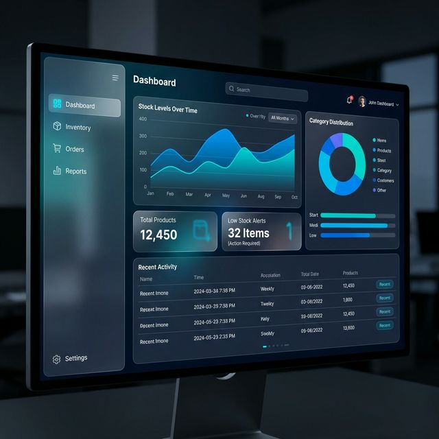

  

# 📦 Inventory Management System
### *Streamlined Tracking for Modern Workflows*

---

**A premium, lightweight solution designed to help students and small businesses manage their inventory with professional-grade precision.**

[**View Demo**](#) • [**Report Bug**](#) • [**Request Feature**](#)

---

## 🚀 Experience the Workflow

| 📂 Setup | 🔑 Access | 🛠️ Tools |
| :--- | :--- | :--- |
| **Simple Deployment**   Copy `inventory/` to `htdocs` | **Role Based**   Admin & Staff portals | **Core Stack**   PHP, MySQL, Vanilla JS |
| **Data Ready**   Import `db/schema.sql` | **Secure**   Password hashed logins | **Responsive**   Desktop to Mobile |

---

## 🔑 Demo Credentials

| Role | Username | Password | Access Level |
| :--- | :--- | :--- | :--- |
| **👑 Administrator** | `admin` | `admin123` | Full Control |
| **👤 Staff Member** | `staff` | `admin123` | View & Manage |

---

## ✨ Premium Features

<table width="100%">
  <tr>
    <td width="50%">
      <h4>📊 Smart Dashboard</h4>
      Real-time stock summaries and automated low-stock indicators to keep your business running smoothly.
    </td>
    <td width="50%">
      <h4>🔄 Flow Control</h4>
      Seamless Stock-IN and Stock-OUT transaction tracking with a permanent audit trail.
    </td>
  </tr>
  <tr>
    <td width="50%">
      <h4>� Product Suite</h4>
      Clean, intuitive management of product lines with high-performance search and filtering.
    </td>
    <td width="50%">
      <h4>📱 Universal UI</h4>
      Crafted with modern CSS for a glassmorphism feel that looks stunning on every device.
    </td>
  </tr>
</table>

---

## ⚙️ Requirements

- **Server environment**: XAMPP, WAMP, or any Apache/PHP server.
- **PHP**: Version 8.0 or higher recommended.
- **Database**: MySQL 5.7+ / MariaDB 10.4+.

---

  Built with ❤️ for the <b>University Web Design Course Presentation</b>.

